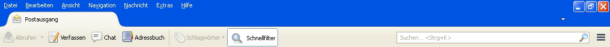
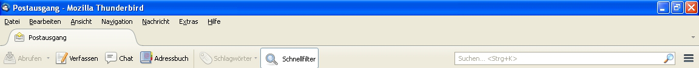

# Show old title bar in Thunderbird

--8<-- "docs/snippets/archive.md"

With the latest release of Thunderbird 17, the menu bar and tabs are drawn into the title bar.
On Windows XP, this then looks like the following:

In the default theme, the active title bar is blue.
Thunderbird adds more stuff to the title bar which increases the blue area.
This looks odd, and fortunately this can be configured.
Go to _Settings > Advanced > Config Editor_ (in the _Advanced Configuration_ section).

Search for the setting `mail.tabs.drawInTitlebar` and change the value to `false` (e.g., by double-clicking on it).
And voilà, much better:

