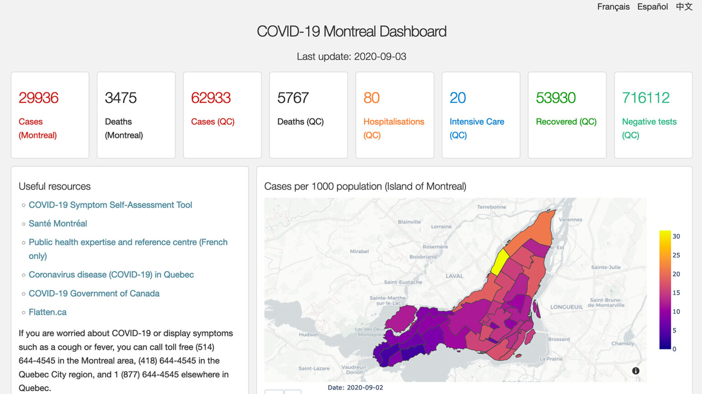
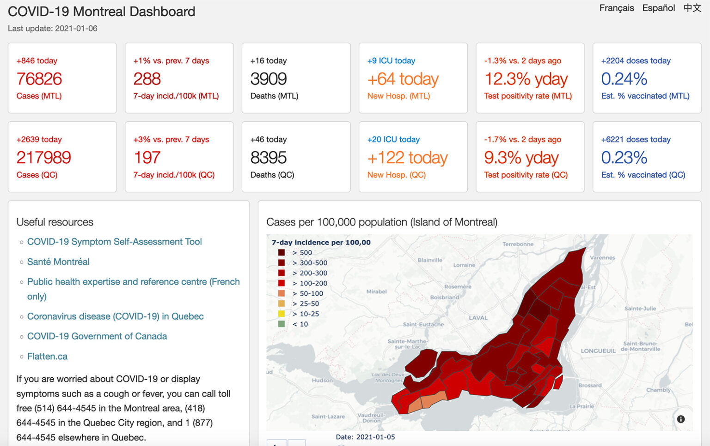

---
categories:
  - Projects
date:
  created: 2021-05-17
  updated: 2021-05-17
migrated: true
slug: covid-19-montreal-dashboard
---

# COVID-19 Montréal Dashboard

Thanks in particular to the great German podcast [Das Coronavirus-Update from NDR](https://www.ndr.de/nachrichten/info/podcast4684.html) with two fantastic virologists (_Christian Drosten_ and _Sandra Ciesek_) I gained a better understanding of the pandemic and this coronavirus (_SARS-CoV-2_) and learned quite a lot new stuff.
Maybe because of this, I felt for a while that there was a lack here (in Québec/Montréal) about how the data is presented/visualized.
But I had this realization "late" (Fall 2020) and didn't have past data so I didn't want to start something from scratch.

One day I randomly came across a repository on GitHub of a [dashboard for Montreal](https://github.com/jeremymoreau/covid19mtl/).
Unfortunately, [the website](https://covid19mtl.ca) hadn't been updated in a while so I reached out to [Jeremy Moreau](https://jeremymoreau.com/) who created it.
We had a chat and I started helping him adding the data, adjusting to new data formats and automating the data retrieval and processing.
Adding the missing data from the past was possible thanks to the [Wayback Machine](https://archive.org/) and (for the most part) to the hard work by _Jean-Paul Soucy_ [archiving all Canada-wide data](https://github.com/ccodwg/Covid19CanadaArchive) for the [COVID-19 Canada Open Data Working Group](https://opencovid.ca/).

<!-- more -->

<figure markdown="span">
  
  <figcaption>COVID-19 Montreal Dashboard in September 2020</figcaption>
</figure>

Besides getting the data up-to-date we also improved the mini boxes on top and updated some of the charts.
For example, the map of Montréal boroughs now is coloured based on the 7-day incidence per 100 000 people (the number of new cases in the last 7 days adjusted for population size)
Due to changes in the pandemic situation, we also added charts for vaccination and variants of concern.

<figure markdown="span">
  
  <figcaption>COVID-19 Montreal Dashboard after relaunch</figcaption>
</figure>

A few months before I had started using [pandas](https://pandas.pydata.org/) for a client project.
Great timing since this was already in use here.
So I could focus on wrangling all the different data formats.
I hadn't used [Plotly/Dash](https://plotly.com/) before but I was able to quickly figure things out and make contributions to the different charts.

The dashboard is available in French, English, Mandarin and Spanish.
And it is [open source](https://github.com/jeremymoreau/covid19mtl) so contributions are more than welcome.
