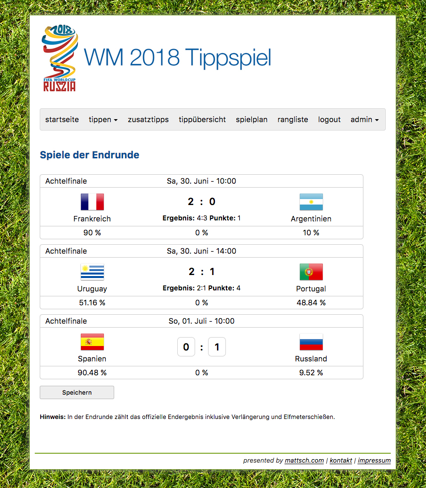

# Projects

A selected list of projects that I created or am/was involved in.
They include both work projects and personal ones.

## Software Engineering

* :material-heart-pulse:{ .lg .middle } **Opal**

    ---

    A solution providing patients timely access to their medical data.
    It empowers patients and their caregivers to play an active role in their care.

    [:octicons-arrow-right-24: Tell me more](#opal)

* :simple-django:{ .lg .middle } **Digital Printing Workflow**

    ---

    A web application built with Python and Django to manage a digital printing workflow including sending print jobs to an industrial printer via JMF/JDF.

    [:octicons-arrow-right-24: Tell me more](#digital-printing-workflow)

* :student:{ .lg .middle } **Concernification Study**

    ---

    A study web site built with TypeScript and Angular to allow study participants to provide their feedback interactively.

    [:octicons-arrow-right-24: Tell me more](#concernification-study)

* :fontawesome-brands-java:{ .lg .middle } **TouchCORE**

    ---

    A tool for software design modelling aimed at developing scalable and reusable software design models.

    [:octicons-arrow-right-24: Tell me more](#touchcore)

## Personal Projects

* :fontawesome-solid-virus-covid:{ .lg .middle } **COVID-19 Montreal Dashboard**

    ---

    A dashboard built with [Plotly Dash](https://dash.plotly.com/) for the epidemiological situation of the corona virus pandemic in Montréal and Québec.

    [:octicons-arrow-right-24: Tell me more](#covid-19-montreal-dashboard)

* :simple-python:{ .lg .middle } **SEPAQ Availability Scraper**

    ---

    A scraper for availability of [SEPAQ](https://www.sepaq.com) camp sites that makes it easier to find available camping spots across all SEPAQ parks.

    [:octicons-arrow-right-24: Tell me more](#sepaq-availability-scraper)

* :soccer:{ .lg .middle } **Tippspiel**

    ---

    A web application for users to predict results of football (aka. soccer) matches and compete with each other.

    [:octicons-arrow-right-24: Tell me more](#tippspiel)

## Archive

* :simple-django:{ .lg .middle } **Docker Monitor**

    ---

    A simple helper script that allows you to monitor docker containers to ensure they are running and healthy.

    [:octicons-arrow-right-24: Tell me more](#docker-monitor)

* :raised_hand:{ .lg .middle } **Kinect Project**

    ---

    A university project using the Kinect for an experiment to measure how humans perform pointing in 3D.

    [:octicons-arrow-right-24: Tell me more](#kinect-project)

* :fontawesome-brands-wordpress-simple:{ .lg .middle } **Hochseilgarten Nagold**

    ---

    A responsive website set up using Wordpress for a high ropes garden.
    <!-- It includes a booking calendar to show the schedule. -->

    [:octicons-arrow-right-24: Tell me more](#hochseilgarten-nagold)

* :fontawesome-brands-php:{ .lg .middle } **Max Payne Zone**

    ---

    A fan site for the game _Max Payne_ providing news about the game in German.

    [:octicons-arrow-right-24: Tell me more](#max-payne-zone)

## Project Details

### Opal

Since 2021 I have been working with the [Opal Health Informatics Group](https://www.opalmedapps.com) on the Opal solution.
As the Software Architect I am overseeing the software architecture and future design of Opal.

### Digital Printing Workflow

In 2020 I built a web app for a client to manage a digital printing workflow.
The web app helps keep the overview of print jobs and allows the user to follow the progress from planning, printing, to production, shipment, and completion (it has been invoiced).
This web app significantly decreases the manual steps (which are error-prone) to be performed by a user and therefore reduces the potential for errors.
It has successfully helped to manage large amounts of print jobs during peak times.

[Django](https://www.djangoproject.com) is used to define a general model (data structure) for all data which is coming from various sources (XML, CSV, PDF, HTML).
Individual small services/components are used to process these different sources.
I did consider a microservice architecture but for the type of application it is overkill and would have unnecessarily increased the complexity.
The services/components were developed separately and packaged as Python packages.
Some are containerized while others are dependencies of (i.e., part of) the Django web app.

A central part is the ability to print a job directly from the web app on the production printer.
This is accomplished by integrating the printer via the industry standard _JDF_/_JMF_.
_JMF_ stands for _Job Messaging Format_ and is a communication protocol based on XML over HTTP.
_JDF_ stands for _Job Definition Format_ which describes the print ticket in XML for the production printer.

In this project I used a linter and wrote unit tests from the beginning and have to say that has helped to increase the quality of the application.
It has lead to only a few bugs that made it into production.
I also used [drone](https://www.drone.io/) as the continuous integration server and for deployment to the staging environment.

**Information:**

* **Backend:** Python, Django, PostgreSQL
* **Frontend:** CSS, HTML, JavaScript, jQuery, Bootstrap
* **Other:** Docker, Unit Testing, CI/CD, Web/Document Scraping, Data Analysis (pandas), Git, Bash, XML, JSON, Network Printing via JDF/JMF

### Concernification Study

In 2018, during my [PhD research](../research/index.md) I designed an algorithm that extracts a feature model along with the API for each feature from a framework.
This is done by looking at examples that are typically provided to show different use cases/features of the framework.
I needed to evaluate the accuracy of the algorithm with a user study.

To allow participant to provide feedback in an interactive way, I built a web application using [Angular](https://angular.dev/) on the client-side and [Node.js](https://nodejs.org) on the server-side.
The feedback is collected for evaluating the result of an algorithm I designed, which extracts a concern (feature model and the corresponding API for each feature) of a software framework.
The framework I mainly used is the _Android SDK_ (specifically the [notifications part](https://developer.android.com/reference/android/app/Notification)).

<figure markdown="span">
  { width="500" }
  <figcaption>Introduction to the Concernification Study with instructions</figcaption>
</figure>

<figure markdown="span">
  { width="500" }
  <figcaption>Giving feedback on the feature model of a framework</figcaption>
</figure>

<figure markdown="span">
  { width="500" }
  <figcaption>Adding a missing feature</figcaption>
</figure>

<figure markdown="span">
  { width="500" }
  <figcaption>Giving feedback on the API of a feature</figcaption>
</figure>

The diagram part is done using [GoJS](https://gojs.net/latest/index.html), a nice JavaScript Diagram framework.
The remainder of the UI is done using [Bootstrap](https://getbootstrap.com/) and [jQuery](https://jquery.com/).
The study data is loaded from JSON files.
Once a user submits the feedback, an API is called on a Node.js server which then stores the data.

**Information:**

* **Technologies:** Angular, TypeScript/JavaScript, Node.js, Express.js, REST, JSON, HTML, CSS, Git
* **[Try it out](https://concernification.mattsch.com/android-notifications2-test)**

### TouchCORE

During my PhD, I was part of a team (as the Lead Software Developer/Software Architect) working on [TouchCORE](https://djeminy.github.io/touchcore/), which is a multitouch-enabled tool for agile concern-oriented software design modeling aimed at developing scalable and reusable software design models.

<figure markdown="span">
  { width="500" }
  <figcaption>Feature Model in TouchCORE</figcaption>
</figure>

<figure markdown="span">
  { width="500" }
  <figcaption>Impact Model in TouchCORE</figcaption>
</figure>

<figure markdown="span">
  { width="500" }
  <figcaption>Class Diagram in TouchCORE</figcaption>
</figure>

Besides the main focus being on reuse, the tool also focusses on allowing users to quickly and seamlessly build software design models.
It provides a touch-based interface allowing the user to use multitouch gestures besides using the traditional keyboard and mouse.
For example, I designed the sequence diagram editor that allows a user to define the behaviour for the given class diagram in a fast and intuitive way.

<figure markdown="span">
  { width="500" }
  <figcaption>Sequence Diagram in TouchCORE</figcaption>
</figure>

At the end, the user can generate the code for the design.

The backend is built with the [Eclipse Modeling Framework (EMF)](https://www.eclipse.org/modeling/emf/) and the frontend with [MT4j](https://github.com/mschoettle/mt4j) to provide the touch-based interface.

<figure markdown="span">
  { width="500" }
  <figcaption>Reusing another concern (a reusable piece of a collection of functionality) in TouchCORE</figcaption>
</figure>

**Information:**

* **Technologies:** Java, OOP, Eclipse Modeling Framework (EMF), XML, Code generation, JUnit, GUI, Git
* **Project Management:** Bitbucket (Issue Tracker, Pull Requests, Code Reviews, Wiki)
* **Videos:**
    * [View Demo Video from my PhD Defence](../assets/videos/phd_defence_demo.mov)
    * [View Demo Teaser from 2014 on Youtube](https://www.youtube.com/watch?v=Am9jp2y2Uds)
    * [View Demo Teaser from 2013 on Youtube](https://www.youtube.com/watch?v=Dxc5LvV3Nsw)

### COVID-19 Montreal Dashboard

Dashboard for the epidemiological situation of the SARS-CoV-2 (coronavirus) pandemic in Montréal and Québec.

<figure markdown="span">
  { width="500" }
</figure>

I started contributing to this project towards the end of 2020.
I helped update it to the latest data formats of data provided from official sources, and adding more graphs.
In addition, I automated the download and update of data every day.
This helped keep the data up-to-date without any manual intervention.

**Information:**

* **Technologies:** Python, pandas, Plotly, Dash, Git, Bash
* [Blog post](../blog/posts/2021/covid-19-montreal-dashboard.md)
* [Project on GitHub](https://github.com/jeremymoreau/covid19mtl/)
* **[View project](https://covid19mtl.ca)**

### SEPAQ Availability Scraper

Scraper for availability of SEPAQ camp sites.
Makes it easier to find available camping spots across all SEPAQ parks.

It extracts all availability information for specific types of camp sites (_Prêt-à-camper_(1) ).
The information is then parsed and camping sites with a given minimum availability (number of days) are extracted and the parks with their date ranges output for review.
{ .annotate }

1. Ready to camp: You only need to bring your food and sleeping bags.

The script can also be adjusted to look at specific camp sites and only look for availability in interested date ranges for those.

**Information:**

* **Technologies:** Python, Web Scraping
* [Read the blog post](../blog/posts/2021/sepaq-availability-scraper.md)
* [Project on GitHub](https://github.com/mschoettle/sepaq-availability-scraper)

### Tippspiel

<figure markdown="span">
  { width="500" }
  <figcaption>The match schedule of a tournament with results</figcaption>
</figure>

<figure markdown="span" class="hidden">
  { width="200" }
  <figcaption>The match schedule of a tournament with results on a small screen</figcaption>
</figure>

A _Tippspiel_ is a prediction game where the game results of (football) matches are predicted and varying points given based on the actual result.
Starting in 2006, I have been running a _Tippspiel_ (almost) every two years for each World Cup and European Championship where approximately 50 users participate for fun.
Besides game results, there are also additional questions (for example, which team will win the World Cup) allowing users to earn bonus points.

<figure markdown="span">
  { width="500" }
  <figcaption>Past guesses and making a guess for the next game</figcaption>
</figure>

<figure markdown="span" class="hidden">
  { width="200" }
  <figcaption>Past guesses and making a guess for the next game on a small screen</figcaption>
</figure>

The frontend is built with HTML5 and CSS3, is responsive(1), and supports Retina screens.
In the screenshots, you can see how the layout and texts are adjusted for smaller screens and mobile devices while showing the same information.
{ .annotate }

1. See the additional screenshots in the "slideshow" when you click on a screenshot.

The backend is built with PHP and MySQL running on an Apache server.
The game data is retrieved from a web service ([OpenLigaDB](https://www.openligadb.de/)) using a REST API and (their older SOAP API) returning JSON.
A script is executed periodically by a cron job to retrieve new match results and new fixtures (for the knockout phase).

**Information:**

* **Technologies:** PHP, MySQL, SOAP/REST API (XML/JSON), HTML5, CSS3, Apache
* **[View Project](https://tippspiel.mattsch.com)**

### Docker Monitor

INFO: This project is archived (not actively maintained anymore).

Simple helper script that allows to monitor docker containers to ensure they are running and healthy. The script only outputs anything in the opposite case (non-running or unhealthy). This allows it to be used for cronjobs etc.

**Information:**

* **Technologies:** Python, Docker, Bash
* [Project on GitHub](https://github.com/mschoettle/docker-monitor)

### Kinect Project

TBD

### Hochseilgarten Nagold

TBD

### Max Payne Zone

TBD
